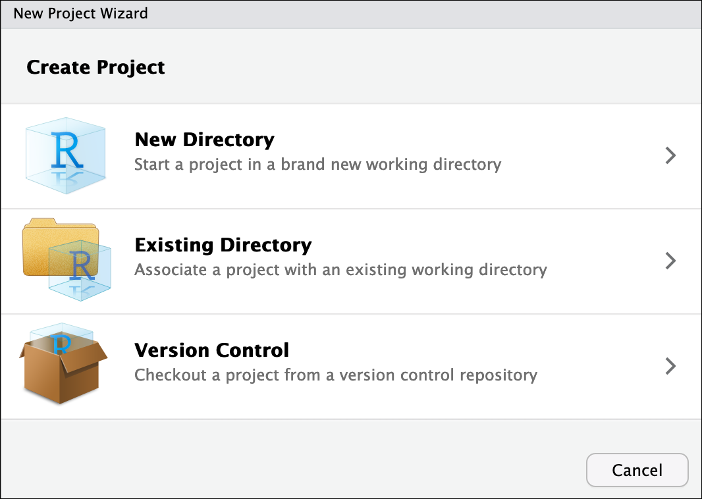

# Introduction to the R programming languange

!!! info
    
    === "Keypoints"
    
        - R is a powerful, popular open-source scripting language
        - RStudio allows you to run R in an easy-to-use interface and makes it
          easy to find help
        - A popular language for it's use in statistical analysis and visualisation tools

    === "Objectives"

        - Create an RStudio project, and know the benefits of working within a project
        - Be able to locate and change the current working directory with `getwd()` and `setwd()`
        - Compose an R script file containing comments and commands
        - Understand what an R function is
        - Locate help for an R function using `?`, `??`, and `args()`
        - Use R to visualise population-specific frequencies of medically relevant genetic variants

## A brief history of R
[R](https://en.wikipedia.org/wiki/R_(programming_language)) has been
around since 1995, and was created by Ross Ihaka and Robert Gentleman at
the University of Auckland, New Zealand. R is based off the S
programming language developed at Bell Labs and was developed to teach
intro statistics.

## Advantages of using R

At more than 20 years old, R is fairly mature and [growing in
popularity](https://www.tiobe.com/tiobe-index/r/). However, programming
isn't a popularity contest. Here are key advantages of analyzing data in
R:

!!! quote ""

    -   **R is [open
        source](https://en.wikipedia.org/wiki/Open-source_software)**. This
        means R is free - an advantage if you are at an institution where
        you have to pay for your own MATLAB or SAS license. Open source is
        important to your colleagues in parts of the world where expensive
        software in inaccessible. It also means that R is actively developed
        by a community (see [r-project.org](https://www.r-project.org/)),
        and there are regular updates.
    -   **R is widely used**. Ok, maybe programming is a popularity contest.
        Because R is used in many areas (not just bioinformatics), you are
        more likely to find help online when you need it. Chances are,
        almost any error message you run into, someone else has already
        experienced.
    -   **R is powerful**. R runs on multiple platforms
        (Windows/MacOS/Linux). It can work with much larger datasets than
        popular spreadsheet programs like Microsoft Excel, and because of
        its scripting capabilities is far more reproducible. Also, there are
        thousands of available software packages for science, including
    genomics and other areas of life science.


## Introducing RStudio Server

In these lessons, we will be making use of a software called
[RStudio](https://www.rstudio.com/products/RStudio/), an [Integrated
Development Environment
(IDE)](https://en.wikipedia.org/wiki/Integrated_development_environment).
RStudio, like most IDEs, provides a graphical interface to R, making it
more user-friendly, and providing dozens of useful features. We will
introduce additional benefits of using RStudio as you cover the lessons.


{width="700"}

!!! quote ""

    -   **Source**: This pane is where you will write/view R scripts. Some
        outputs (such as if you view a dataset using `View()`) will appear
        as a tab here.
    -   **Console/Terminal/Jobs**: This is actually where you see the
        execution of commands. This is the same display you would see if you
        were using R at the command line without RStudio. You can work
        interactively (i.e. enter R commands here), but for the most part we
        will run a script (or lines in a script) in the source pane and
        watch their execution and output here. The "Terminal" tab give you
        access to the BASH terminal (the Linux operating system, unrelated
        to R). RStudio also allows you to run jobs (analyses) in the
        background. This is useful if some analysis will take a while to
        run. You can see the status of those jobs in the background.
    -   **Environment/History**: Here, RStudio will show you what datasets
        and objects (variables) you have created and which are defined in
        memory. You can also see some properties of objects/datasets such as
        their type and dimensions. The "History" tab contains a history of
        the R commands you've executed R.
    -   **Files/Plots/Packages/Help/Viewer**: This multipurpose pane will
        show you the contents of directories on your computer. You can also
        use the "Files" tab to navigate and set the working directory. The
        "Plots" tab will show the output of any plots generated. In
        "Packages" you will see what packages are actively loaded, or you
        can attach installed packages. "Help" will display help files for R
        functions and packages. "Viewer" will allow you to view local web
        content (e.g. HTML outputs).


## Create an RStudio project

One of the first benefits we will take advantage of in RStudio is
something called an **RStudio Project**. An RStudio project allows you
to more easily:

 -   Save data, files, variables, packages, etc. related to a specific
     analysis project
 -   Restart work where you left off
 -   Collaborate, especially if you are using version control such as
    [git](http://swcarpentry.github.io/git-novice/).

!!! info ""


    1.  To create a project, go to the **File** menu, and click **New Project**
    
        {width-"400"}
    
    
    2.  In the window that opens select **Existing Directory**  
        Then select **Browse....**   
        Choose and then click "~/Documents/IndigiDataIntroToR".  
    
    3.  Finally click `Create Project`. In the
        "Files" tab of your output pane (more about the RStudio layout in a
        moment), you should see an RStudio project file,
        **IndigiDataIntroToR.Rproj**. All RStudio projects end with the
        "**.Rproj**" file extension.
    


## Creating your first R script

Now that we are ready to start exploring R, we will want to keep a
record of the commands we are using. To do this we can create an R
script:

Click the `File` menu and select
`New File` and then `R
Script`. Before we go any further, save your script by
clicking the save/disk icon that is in the bar above the first line in
the script editor, or click the `File` menu
and select `save`. In the "Save File" window
that opens, name your file **"indigidataIntroToR"**. The new script
**indigidataIntroToR.R** should appear under "files" in the output pane.
By convention, R scripts end with the file extension **.R**.

## Getting to work with R: navigating directories

Now that we have covered the more aesthetic aspects of RStudio, we can
get to work using some commands. We will write, execute, and save the
commands we learn in our **indigidataIntroToR.R** script that is loaded
in the Source pane. First, lets see what directory we are in. To do so,
type the following command into the script:

!!! r-project

    `getwd()`

To execute this command, make sure your cursor is on the same line the
command is written. Then click the `Run`
button that is just above the first line of your script in the header of
the Source pane.

In the console, we expect to see the following output :

!!! solution ""
    `[1] "/home/Documents/IndigiDataIntroToR"`

* Notice, at the Console, you will also see the instruction you executed above the output in blue.

Since we will be learning several commands, we may already want to keep
some short notes in our script to explain the purpose of the command.
Entering a `#` before any line in an R script turns that line into a
comment, which R will not try to interpret as code. Edit your script to
include a comment on the purpose of commands you are learning, e.g.:

!!! r-project

    `# this command shows the current working directory 
    
    getwd()`

!!! question "Exercise : Work interactively in R"   
   
    What happens when you try to enter the `getwd()` command in the Console pane?
   
    ??? success "Solution"

         You will get the same output you did as when you ran `getwd()` from
         the source. You can run any command in the Console, however,
         executing it from the source script will make it easier for us to
         record what we have done, and ultimately run an entire script,
         instead of entering commands one-by-one. 
         
For the purposes of this exercise we want you to be in the directory
`"/home/<USERID>/IndigiDataIntroToR"`. What if you weren't? You can set your home directory using the `setwd()` command. Alternatively, RStudio has a helpful button for setting your working directory (*note* that this is a very simplified way to set your working directory, and this is actually a bit more complex in practice.)

    

## Using functions in R, without needing to master them

A function in R (or any computing language) is a short program that
takes some input and returns some output. Functions may seem like an
advanced topic (and they are), but you have already used at least one
function in R. `getwd()` is a function! The next sections will help you
understand what is happening in any R script.

!!! question "Exercise: What do these functions do?"
   
    Try the following functions by writing them in your script. See if you
    can guess what they do, and make sure to add comments to your script
    about your assumed purpose. - `dir()` - `sessionInfo()` - `date()` -
    `Sys.time()`
   
    ??? success "Solution"
        
        -   `dir()` \# Lists files in the working directory
        -   `sessionInfo()` \# Gives the version of R and additional info
            including on attached packages
        -   `date()` \# Gives the current date
        -   `Sys.time()` \# Gives the current time
        -   `.libPaths()` \# Shows what libraries are available
        
        **Notice**: Commands are case sensitive! 

You have hopefully noticed a pattern - an R function has three key
properties: 

- Functions have a name (e.g. `dir`, `getwd`); note that
functions are case sensitive! 

- Following the name, functions have a
pair of `()` 

- Inside the parentheses, a function may take 0 or more
arguments.

An argument may be a specific input for your function and/or may modify
the function's behavior. For example the function `round()` will round a
number with a decimal:

!!! r-project

    ``` 
    # This will round a number to the nearest integer
    round(3.14)
    ```

## Getting help with function arguments

What if you wanted to round to one significant digit? `round()` can do
this, but you may first need to read the help to find out how. To see
the help (In R sometimes also called a "vignette") enter a `?` in front
of the function name:

!!! r-project
    `?round()`

The "Help" tab will show you information (often, too much information).
You will slowly learn how to read and make sense of help files. Checking
the "Usage" or "Examples" headings is often a good place to look first.
If you look under "Arguments," we also see what arguments we can pass to
this function to modify its behavior. You can also see a function's
argument using the `args()` function:

!!! r-project
    `args(round)`


`round()` takes two arguments, `x`, which is the number to be rounded,
and a `digits` argument. The `=` sign indicates that a default (in this
case 0) is already set. Since `x` is not set, `round()` requires we
provide it, in contrast to `digits` where R will use the default value 0
unless you explicitly provide a different value. We can explicitly set
the digits parameter when we call the function:

!!! r-project
    `round(3.14159, digits = 2)`


Or, R accepts what we call "positional arguments", if you pass a
function arguments separated by commas, R assumes that they are in the
order you saw when we used `args()`. In the case below that means that
`x` is 3.14159 and digits is 2.

!!! r-project
    `round(3.14159, 2)`

Finally, what if you are using `?` to get help for a function in a
package not installed on your system, such as when you are running a
script which has dependencies.

!!! r-project
    `geom_point()`

will return an error:

!!! failure "Error"
    ```
    Error in .helpForCall(topicExpr, parent.frame()) :
       no methods for ‘geom_point’ and no documentation for it as a function
    ```


Use two question marks (i.e. `??geom_point()`) and R will return results
from a search of the documentation for packages you have installed on
your computer in the "Help" tab. Finally, if you think there should be a
function, for example a statistical test, but you aren't sure what it is
called in R, or what functions may be available, use the `help.search()`
function.

!!! question "Exercise: Searching for R functions"
   
    Use `help.search()` to find R functions for the following statistical
    functions. Remember to put your search query in quotes inside the
    function's parentheses.
   
    -   Chi-Squared test
    -   Student t-test
    -   mixed linear model
   
    ??? success Solution
    
        While your search results may return several tests, we list a few
        you might find: 

        - Chi-Squared test: `stats::Chisquare` 
        - Student t-test: `stats::t.test` 
        - mixed linear model: `stats::lm.glm`

