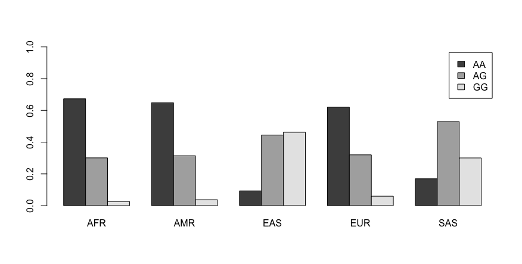

# Analysing genetic variant data in R

!!! info
    
    === "Keypoints"
    
        - R can hold data as Objects and Functions can be used to ask questions of that data
        - The 1000 Genomes Project is a public resource for genetic data
        - SNPS (Single Nucleotide Polymorphisms) are small changes to our DNA that can be medically relevant

    === "Objectives"

        - Load publicly (freely) available data from The 1000 Genomes Project into R
        - Understand how SNP data varies between populations


## The data: Single Nucleotide Polymorphisms (SNPS) from the 1000 Genomes Project

The data you will be working with today is publicly available high-throughput sequencing data from a resource called the 1000 genomes project. 

We have downloaded a (small) subset of the 1000 genomes data, called the file snpData.txt, and placed it in your home directory (`/home/$USER/IndigiDataIntroToR/`). To read the 'snpData.txt' data file into R, we will use the read.table() function:

!!! r-project "r"

    ```r
    # Read in the txt file and save it as 'snpData'

    snpData <- read.table("/home/<USERID>/IndigiDataIntroToR/snpData.txt",sep='\t',header=T)
    ```

Reminder: the format here is to create a new object (snpData) and store some information in it, in this case storing information that is obtained using the read.table function. The format for function is 'function(target of the function, refining or specifying the details)'.

Let's use some other functions to inspect the data and learn basic facts about the structure of our data object:

!!! r-project "r"

    ```r
    # The dim function will tell us how many rows (individuals) and columns the dataset contains:

    dim(snpData)

    ## [1] 2504     9
    ```

This tells us there are 2504 rows and 9 columns. We know that the rows are individuals, but what are the columns? 

The 'names' function can be used to the column names:

!!! r-project "r"

    ```r
    names(snpData)
    ```

??? success "Output"

    ```
## [1] "SubjectID"  "Population" "rs3826656"  "rs13387042" "rs4779584"  "rs2398162"  "rs1344706"  "rs7659604"  "rs734553"
    ```
This function shows us the names of the nine columns: The first two tell us the SubjectID (an identifier for the individual from whom the data was collected) and Population (where the individual came from). The next seven names are "rs" followed by a string of numbers. These rs numbers are SNP names - each known SNP has a unique identifier. 

What **are** SNPs?

SNPs (Single Nucleotide Polymorphisms) are places in the genome where some individuals in the population have variation at a single DNA base (e.g., some people may have an "A" base at a certain location in the genome, while others have a "G" at that exact same location). The majority of SNPs don't have a (known) impact on health or function, but some do. One of the things we often ask about a SNP is how common is it in the population.


To look at the full dataset, you can use the View() function:
!!! r-project "r"

    ```r
    View(snpData)
    ```

For each individual we can see the base pairs they have at the particular SNP location (locus) in the genome. Note that there are always two bases, one from each pair of chromosomes, so if a SNP is either an A or G an individual can be AA, AG, or GG. 

The second column is called “Population”. We can make a table of this information to see how many individuals are present in each population (the “$” sign tells R to use the “Population” column from the “snpData”” object):

``` r
table(snpData$Population)
```

    ## 
    ## AFR AMR EAS EUR SAS 
    ## 661 347 504 503 489

The super-population codes are:

AFR, African; 
AMR, Ad-Mixed American; 
EAS, East Asian; 
EUR, European;
SAS, South Asian.

Additional information about the composition of these populations can be
found at:

<http://www.internationalgenome.org/faq/which-populations-are-part-your-study>
 


## Looking at SNP frequencies

The other seven columns in the data set relate to specific single
nucleotide polymorphisms (SNPs) in the genome - we have the genotype
data for each SNP for every individual in the data set.

We can use the “table” command again to summarize the genotype
information for each SNP:

``` r
## Make a genotype frequency table for the first SNP
table(snpData$rs3826656)
```

    ## 
    ##   AA   AG   GG 
    ## 1112  952  440

We can also calculate the proportions associated with each genotype:

``` r
## Calculate proportions
prop.table(table(snpData$rs3826656))
```

    ## 
    ##        AA        AG        GG 
    ## 0.4440895 0.3801917 0.1757188

and examine differences in genotype frequencies across populations:

``` r
## Create contingeny table - genotypes across populations
table(snpData$Population, snpData$rs3826656)
```

    ##      
    ##        AA  AG  GG
    ##   AFR 445 199  17
    ##   AMR 225 109  13
    ##   EAS  47 224 233
    ##   EUR 312 161  30
    ##   SAS  83 259 147

``` r
## And calculate proportions (rounded)
round(prop.table(table(snpData$Population, snpData$rs3826656),1),2)
```


    ##      
    ##         AA   AG   GG
    ##   AFR 0.67 0.30 0.03
    ##   AMR 0.65 0.31 0.04
    ##   EAS 0.09 0.44 0.46
    ##   EUR 0.62 0.32 0.06
    ##   SAS 0.17 0.53 0.30

These results can be plotted as a bar plot:

``` r
snpFreqs = t(prop.table(table(snpData$Population, snpData$rs3826656), 1))
barplot(snpFreqs, beside=TRUE, legend.text=TRUE, ylim=c(0,1))
```



These analyses can be repeated for different SNPs by changing the SNP ID
(e.g., rs3826656) in the above commands.


### Why look at these SNPs?

The seven SNPs contained in this data set were not just randomly chosen - they are SNPs that have been found to be associated with altered disease risk. That is, an individual’s genotype at a particular position in the genome affects their risk of developing a particular disease. This is not absolute though, it really just raises or lowers the probability of disease - it doesn’t guarantee complete protection or susceptibility.

| SNP        | Link                                          | Alleles | Nearby Gene | Disease                            |
|------------|-----------------------------------------------|---------|-------------|------------------------------------|
| rs3826656  | <http://www.snpedia.com/index.php/Rs3826656>  | A/G     | CD33        | Alzheimer’s Disease                |
| rs13387042 | <http://www.snpedia.com/index.php/Rs13387042> | A/G     | DIRC3       | Breast Cancer                      |
| rs4779584  | <http://www.snpedia.com/index.php/Rs4779584>  | T/C     | GREM1       | Colorectal Cancer                  |
| rs2398162  | <http://www.snpedia.com/index.php/Rs2398162>  | A/G     | NR2F2       | Hypertension                       |
| rs1344706  | <http://www.snpedia.com/index.php/Rs1344706>  | A/C     | ZNF408A     | Schizophrenia and Bipolar Disorder |
| rs7659604  | <http://www.snpedia.com/index.php/Rs7659604>  | T/C     | TMEM155     | Type 2 Diabetes                    |
| rs734553   | <http://www.snpedia.com/index.php/Rs734553>   | T/G     | SLC2A9      | Gout                               |

For each SNP, increased risk of disease is associated with the minor
allele. Variation in genotype frequencies across populations can help to
explain some of the population-specific differences in rates of
different diseases.

Clicking on SNP IDs in the table above will link through to aditional
information about each variant.