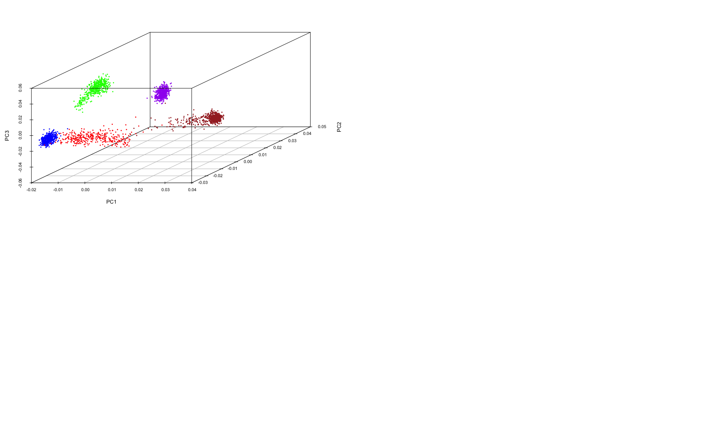

# R for statistical tools and tests

!!! info
    
    === "Keypoints"
    
        - R is popular for statistical tests
        - PCA can make your data easier to comprehend
        - Genetic variation can be population-specific

    === "Objectives"

        - Investigate diversity in population-specific genetic variation
        - Understand PCA and how to run it in R
        

## Population diversity

We will now load a second dataset which contains a new set of SNPs. Rather than being medically relevant, these SNPs were chosen because they are informative about ancestry. That is, variation in their genotype frequencies tends to be associated with differences between population groups. 

!!! r-project

    ```r
    ## Load ancestry data
    snpAns = read.table('GENE360snpAncestry.txt', header=T, sep='\t')
    ## Check dimensionality of data
    dim(snpAns)
    ```

??? success "Output"

    ```
    [1] 2504 2305
    ```  

Now we now have a *much* larger dataset: 2504 individuals and 2302 SNP genotypes for each individual. 
**Note**: I've said there are 2302 SNP genotypes, but the dim function above returned 2305 columns. Think back to some of the functions you have used earlier and use one (or more) to check what the other three columns are. 

??? success "Solution"

        A)

        !!! r-project

            ```r
            View(snpAns)
            ```
        
        
        B)

        !!! r-project

            ```r
            names(snpAns)
            ```
        

This new dataset includes not just the super populations we worked with previously, but also sub-populations. We can create a table that breaks down each super population into subpopulations:

!!! r-project

    ```r
    table(snpAns$SubPopulation, snpAns$Population)
    ```


??? success "Output"
    ```
    ##          
    ##           AFR AMR EAS EUR SAS
    ##   AFR_ACB  96   0   0   0   0
    ##   AFR_ASW  61   0   0   0   0
    ##   AFR_ESN  99   0   0   0   0
    ##   AFR_GWD 113   0   0   0   0
    ##   AFR_LWK  99   0   0   0   0
    ##   AFR_MSL  85   0   0   0   0
    ##   AFR_YRI 108   0   0   0   0
    ##   AMR_CLM   0  94   0   0   0
    ##   AMR_MXL   0  64   0   0   0
    ##   AMR_PEL   0  85   0   0   0
    ##   AMR_PUR   0 104   0   0   0
    ##   EAS_CDX   0   0  93   0   0
    ##   EAS_CHB   0   0 103   0   0
    ##   EAS_CHS   0   0 105   0   0
    ##   EAS_JPT   0   0 104   0   0
    ##   EAS_KHV   0   0  99   0   0
    ##   EUR_CEU   0   0   0  99   0
    ##   EUR_FIN   0   0   0  99   0
    ##   EUR_GBR   0   0   0  91   0
    ##   EUR_IBS   0   0   0 107   0
    ##   EUR_TSI   0   0   0 107   0
    ##   SAS_BEB   0   0   0   0  86
    ##   SAS_GIH   0   0   0   0 103
    ##   SAS_ITU   0   0   0   0 102
    ##   SAS_PJL   0   0   0   0  96
    ##   SAS_STU   0   0   0   0 102
    ```


To examine population diversity we need to do two things:

1. Create a data object of *only* the SNP genotype data (i.e., remove the first three columns).

2. Convert the genotypes to allele counts (e.g., if we wanted to count the number of A's: TT, AT, AA becomes 0, 1, 2, respectively).

Step 1:
!!! r-project

    ```r
    ## Create a new object called snpAnsDat which contains only the SNP data. 
    ## To do this we will take all the data from snpAns except rows 1, 2 and 3:
    snpAnsData = snpAns[,-c(1,2,3)]
    ```

Step 2:
!!! r-project

    ```r
    ## Load a custom function to convert genotypes (AA, AT, TT) into allele counts (2, 1, 0 if we are counting A's).
    alleleCounts <- function(x){
        gt <- names(table(x))
        alleles <- unique(unlist(strsplit(gt,'')))
        oo <- order(sapply(alleles,function(z) sum(grep(z,x))),decreasing=T)
        alleles <- alleles[oo]
        geno<-c(paste(alleles[1],alleles[1],collapse='',sep=''),
          paste(sort(alleles),collapse='',sep=''),  
          paste(alleles[2],alleles[2],collapse='',sep=''))
            return(sapply(x,match,geno) - 1)
    }

    source('alleleCounts.R')

    ## Apply the function to the genotype data, one column (SNP) at a time. 
    snpAnsCount = apply(snpAnsData, 2, alleleCounts)

    ```    
We now have a new object that contains just the SNP data represented by allele counts. 

Let's look at this new data set using View():

!!! r-project

    ```r
    View(snpAnsCount)
    ```

### Principal components analysis (PCA)

In terms of examining population diversity, we have 2302 dimensions of
data available - one dimension for each SNP.

Rather than trying to comprehend this huge amount of data in
2302-dimensional space, genetics researchers often use a statistical tool called Principal Components Analysis (PCA) to reduce the dimensionality of the data.

The idea is to find the most important variation in the data, and examine the samples in terms of that variation, ignoring the rest. In practice, this works fairly well, because genetic differences between populations provide a strong (and relatively consistent) source of
variation across genomic loci (i.e., SNPs). Rather than looking at 2302 dimensions of data, we end up looking at variation across just 2 or 3 dimensions - each dimension is defined by a combination of SNPs which vary in a similar way across the individuals in the study.


!!! r-project

    ```r
    ## Load custom function to perform principal components analysis
    pcaGenotypes <- function(x){
        sm<-colMeans(x/2)
        gg <- t(t(x/2) - rowMeans(t(x/2))) / sqrt(sm*(1-sm))
        hh <- 1/ncol(x) * gg%*%t(gg)
        return(eigen(hh)$vectors[,1:3])
    }

    source("pcaGenotypes.R")

    ## Apply this function to the allele count data
    ## This will take a couple of minutes to run
    pca = pcaGenotypes(snpAnsCount)
    ```
    
To visualise the populations across the principal components, we need to define colours for each populations. It doesn't matter what colours you choose, but lets go with: AFR (brown), AMR (red), EAS (purple), EUR (blue), SAS (green).

!!! r-project 
``` r
## Create an object relating to the population data
ansPop = snpAns$Population

## Generate colours to associate with each population
pCols = c("brown","red","purple","blue","green")
popCol = pCols[as.numeric(as.factor(ansPop))]
names(popCol) = ansPop

## Check that they correspond to populations
table(popCol,ansPop)
```

??? success "Output"
    ```
    ##         ansPop
    ## popCol   AFR AMR EAS EUR SAS
    ##   blue     0   0   0 503   0
    ##   brown  661   0   0   0   0
    ##   green    0   0   0   0 489
    ##   purple   0   0 504   0   0
    ##   red      0 347   0   0   0
    ```

Now we can plot the principal components and colour the points based on the population each sample belongs to.

!!! r-project
``` r
## Load a custom plotting function to generate the plots:
plotPCA <- function(x,y){
  par(mfrow=c(2,2))
  plot(0,0,col='white',xlim=c(0,1),ylim=c(0,1),axes=FALSE,xlab='',ylab='')
    #   legend(0.1,0.9,fill=rainbow(length(table(y))),names(table(names(y))))
  colTab = table(popCol,names(popCol))
  colTab = colTab[apply(colTab,2,which.max),]
  pCol = rownames(colTab)
  names(pCol) = colnames(colTab)
  legend(0.1,0.9,fill=pCol,names(pCol))
  plot(x[,1],x[,2],pch=20,col=popCol,xlab="PC 1", ylab="PC 2")
  plot(x[,1],x[,3],pch=20,col=popCol,xlab="PC 1", ylab="PC 3")
  plot(x[,2],x[,3],pch=20,col=popCol,xlab="PC 2", ylab="PC 3")
}

source('plotPCA.R')

## Plot the PCA data that we have generated, along with the population information
plotPCA(pca, popCol)
```


From the plots we can see that samples from the same population tend to cluster together, and that the first three principal components do a reasonable job of capturing the genetic diversity between the populations.

With the `scatterplot3d` package, you can plot the first three principal components at once (i.e., combining the information from the three scatterplots above). This shows that the European (EUR), East Asian (EAS) and South Asian (SAS) super-populations are relatively homogeneous, while the Ad-Mixed American (AMR) and African (AFR) super-populations exhibit greater variation, suggesting admixture within these groups.

!!! r-project
``` r
library(scatterplot3d)
scatterplot3d(pca[,1], pca[,2], pca[,3], color=popCol, pch=16,
              cex.symbols=0.5, xlab="PC1", ylab="PC2", zlab="PC3")
```




## Phylogenetic trees

Another way to visualise genetic similarity is via “phylogenetic trees”, also known more generally as “dendrograms”.

These tree diagrams group items together based on similarity scores. In this setting our “items” are the populations, and the scores are calculated based on the genetic similarities between each pair of populations.

To calculate similarities, we need to create a set of “average” genotypes for each population. One way to do this is to calculate the frequency of the major homozygote for each SNP in each population.

!!! r-project
``` r
## Load custom function for calculating major homozygote frequency:
calcMajorFreq<-function(x,y){
## x is count-based genotypes
## y is population data  
  pops<-names(table(y))
  gtFreq<-matrix(0,length(pops),ncol(x))
  for(i in seq(pops))
    gtFreq[i,] <- apply(x[as.vector(y)==pops[i],],2,function(z) 1-prop.table(table(z))[1])
  gtFreq[is.na(gtFreq)]<-0
  rownames(gtFreq)<-pops
  colnames(gtFreq)<-colnames(x)
  return(gtFreq)
}

source('calcMajorFreq.R')

## Apply this function to the SNP count data
## Takes a few seconds
popFreqs = calcMajorFreq(snpAnsCount, ansPop)
```

!!! r-project
``` r
## Make a cluster tree based on these frequencies
plot(hclust(dist(popFreqs)),hang=-1)
```


The way in which the “leaves” of the tree cluster, reflects the similarity between the items analysed. In this case the populations are grouped based on their genetic similarity, as measured by these particular loci. Here it appears that the AMR (Ad-Mixed American), and SAS (South Asian) super-populations are most genetically similar, then
EUR (European), followed by EAS (East Asian). The AFR (African) super-population is the most genetically dissimilar relative to the others. It is likely that these groupings reflect (to some degree) migration patterns and shared ancestry experienced by these populations.


### Key takeaways

R has hundreds of functions that can do a wide range of tasks, from simple (view data, calculate mean, show you the range (min/max) values) to highly complex.

R is an excellent programming language for statistical analyses of large data sets.

R is *really* useful for making quick plots and tables to visualise your data.

Large, publicly available datasets are a tremendous resource. 